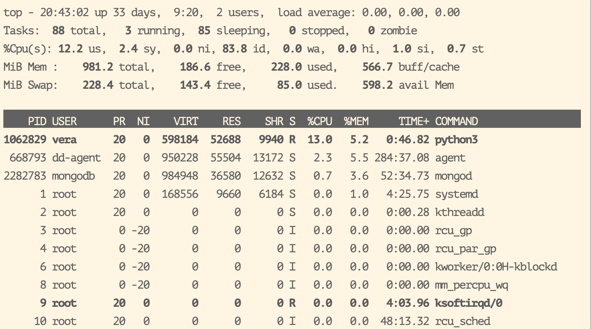
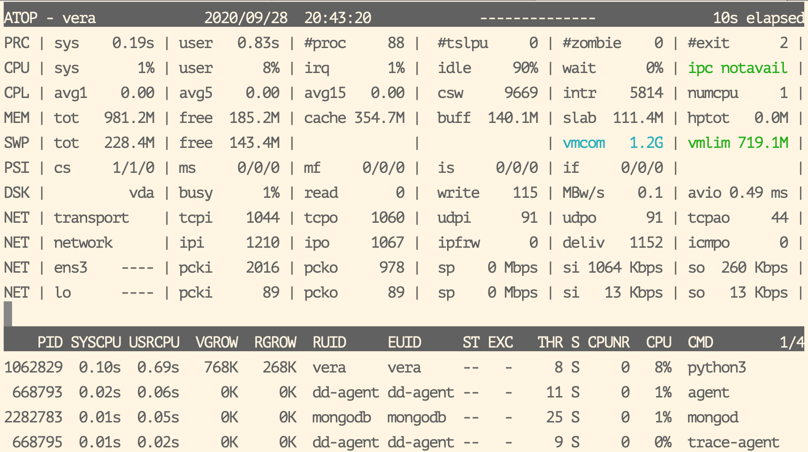
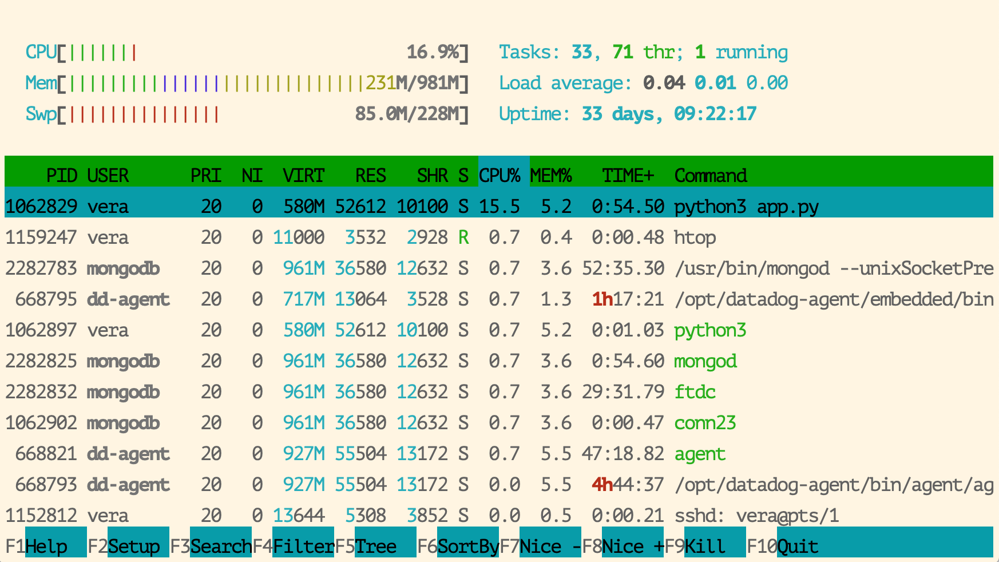
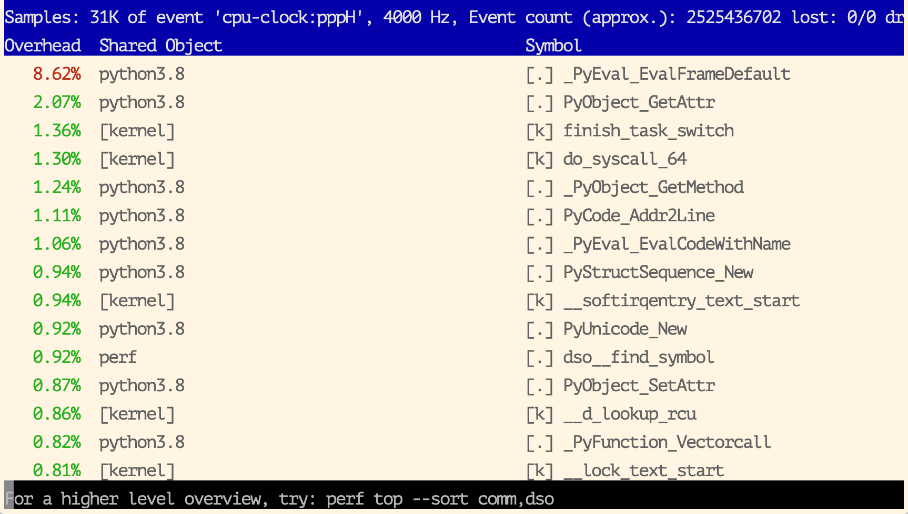
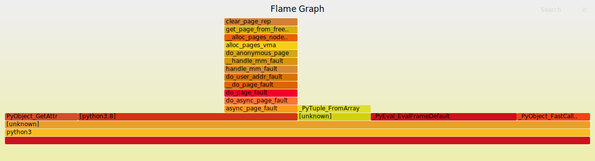
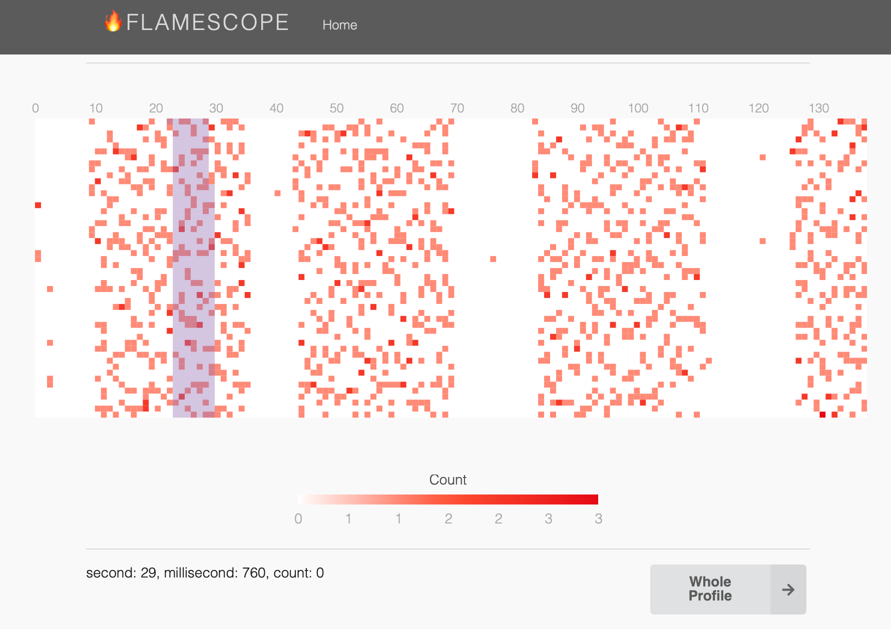
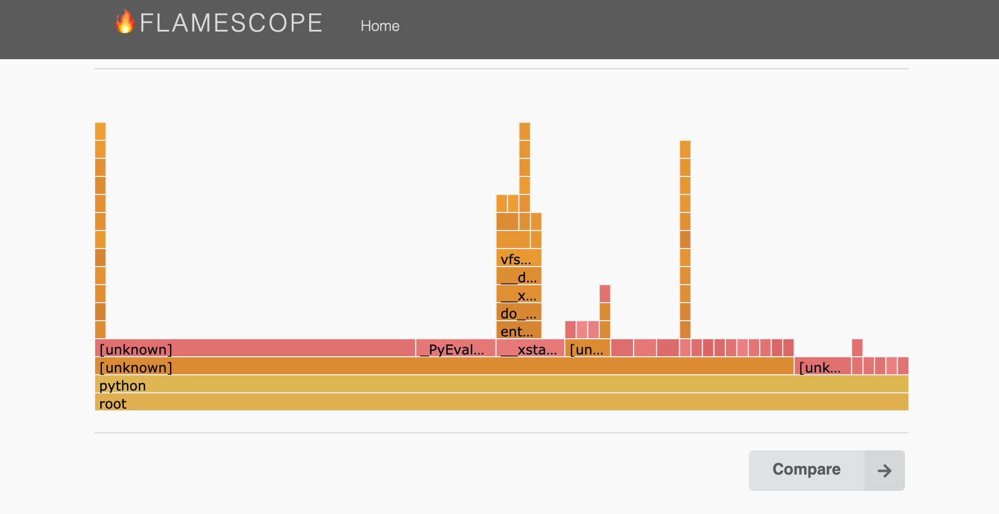
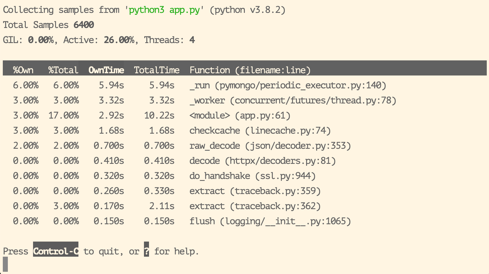
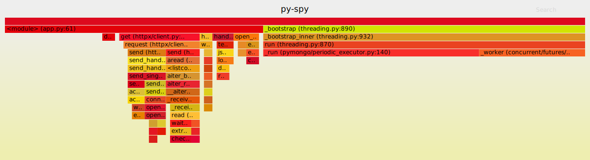

# Диагностика запущенных в ОС (🐧, ) python-приложений

<a name="index"></a>
* [Информация о процессах](#processes)
([pstree](#pstree), [pgrep](#pgrep), [pidof](#pidof), [pidstat](#pidstat), [/proc/{PID}](#proc), [ps](#ps), [top](#top), [atop](#atop), [htop](#htop))
* [Файлы, сеть](#misc)
([lsof](#lsof), [netstat](#netstat))
* [Системные и библиотечные вызовы](#syscalls)
([strace](#strace), [ltrace](#ltrace), [dtruss](#dtruss))
* [Профилирование](#profiling)
([perf](#perf), [py-spy](#py-spy))
* [Фреймворки динамической трассировки](#tracing)
([eBPF](#ebpf), [Dtrace](#dtrace))
* [Сбор метрик из приложения для отображения на графиках](#metrics)
([timings](#timings), [gc](#gc), [locks](#locks))
* [Доп. литература](#resources)

<a name="processes"></a>
## Информация о процессах [^](#index "к оглавлению")

Узнаем о состоянии нашего приложения и всей системы при помощи нескольких утилит. Для проведения диагностики нам понадобится узнать pid процесса. В системе также присутствуют и другие приложения, которые могут оказывать влияние на наше. 
Рассмотрим ряд полезных программ на примере тестовой виртуалки, где работает nginx, асинхронное python-приложение, mongodb, а для мониторинга используется сервис datadog.
Для каждой программы подробная справка с дополнительными опциями доступна по `man <name>`

<a name="pstree"></a>
### pstree [^](#index "к оглавлению")
Отображает дерево процессов. Доп опции `pt` включат отображение pid и потоков.

```console
vera@vera$ pstree -pt
systemd(1)─┬─accounts-daemon(323)─┬─{gdbus}(332)
           │                      └─{gmain}(338)
           ├─cron(325)
           ├─nginx(669630)───nginx(669631)
           ├─python3(1062829)─┬─{python3}(1062341)
           │                  ├─{python3}(1062342)
           │                  ├─{python3}(1062343)
           │                  ├─{python3}(1062344)
           │                  ├─{python3}(1062397)
           │                  ├─{python3}(1062398)
           │                  └─{python3}(1062301)
           ├─rsyslogd(339)─┬─{in:imklog}(337)
           │               ├─{in:imuxsock}(336)
           │               └─{rs:main Q:Reg}(338)
           ├─systemd(1041938)───(sd-pam)(1041935)
           ├─systemd-journal(238)
           └─systemd-udevd(235)
```

<a name="pgrep"></a>
### pgrep [^](#index "к оглавлению")
Поиск процесса по имени и некоторым атрибутам. Аналогичная `pkill` - посылает найденным процессам сигнал.
```console
vera@vera$ pgrep -a nginx
669640 nginx: master process /usr/sbin/nginx -g daemon on; master_process on;
669641 nginx: worker process 
```

<a name="pidof"></a>
### pidof [^](#index "к оглавлению")
Аналог `pgrep`. Выводит список pid процессов, имя которых совпадает с заданным
```console
vera@vera$ pidof python3
1062859 427357 357
```
и действительно
```console
vera@vera$ ps aux | grep 'python'
root         357  0.0  0.4  34900  4832 ?        Ss   Aug26   0:00 /usr/bin/python3 /usr/bin/networkd-dispatcher 
root      427357  0.0  0.9 434428  9648 ?        Ss   Sep12   0:01 /usr/bin/python3 /usr/bin/glances
vera     1062859  0.0  4.8 545896 48272 ?        Ssl  13:22   0:07 python3 app.py
```

<a name="pidstat"></a>
### pidstat [^](#index "к оглавлению")
Статистика по процессам. Добавим `-p <PID> 1` - по процессу с pid каждую секунду. На 2-7 секундах подавалась нагрузка.
```console
vera@vera$ pidstat -p 1052829 1
Linux 5.4.0-29-generic (vera) 	09/28/20 	_x86_64_	(1 CPU)

14:52:31      UID       PID    %usr %system  %guest   %wait    %CPU   CPU  Command
14:52:32     1000   1052829    0.00    0.00    0.00    0.00    0.00     0  python3
14:52:33     1000   1052829    2.00    1.00    0.00    0.00    3.00     0  python3
14:52:34     1000   1052829    3.00    0.00    0.00    0.00    3.00     0  python3
14:52:35     1000   1052829    3.00    1.00    0.00    1.00    4.00     0  python3
14:52:36     1000   1052829    3.00    0.00    0.00    0.00    3.00     0  python3
14:52:37     1000   1052829    4.00    0.00    0.00    0.00    4.00     0  python3
14:52:38     1000   1052829    0.00    0.00    0.00    0.00    0.00     0  python3
14:52:39     1000   1052829    0.00    1.00    0.00    0.00    1.00     0  python3
^C
Average:     1000   1052829    1.50    0.30    0.00    0.10    1.80     -  python3
```

<a name="proc"></a>
### /proc/{PID} [^](#index "к оглавлению")
Информация о нашем процессе есть в файловой системе `/proc`.
```console
vera@vera$ ls /proc/1064829
arch_status      environ    mountinfo      personality   statm
attr             exe        mounts         projid_map    status
autogroup        fd         mountstats     root          syscall
auxv             fdinfo     net            sched         task
cgroup           gid_map    ns             schedstat     timers
clear_refs       io         numa_maps      sessionid     timerslack_ns
cmdline          limits     oom_adj        setgroups     uid_map
comm             loginuid   oom_score      smaps         wchan
coredump_filter  map_files  oom_score_adj  smaps_rollup
cpuset           maps       pagemap        stack
cwd              mem        patch_state    stat
```
Рассмотрим несколько примеров. 

* `status` - состояние процесса, pid, threads, parent pid (в данном случае 1 - наше приложение запустил `systemd`) и менее полезное.

```console
vera@vera$ cat /proc/1052829/status
Name:	python3
Umask:	0022
State:	S (sleeping)
Tgid:	1062829
Ngid:	0
Pid:	1062829
PPid:	1
TracerPid:	0
Uid:	1000	1000	1000	1000
Gid:	1000	1000	1000	1000
FDSize:	128
Groups:	27 1000 
NStgid:	1062829
NSpid:	1062829
NSpgid:	1062829
NSsid:	1062829
VmPeak:	  602668 kB
VmSize:	  595456 kB
VmLck:	       0 kB
VmPin:	       0 kB
VmHWM:	   55208 kB
VmRSS:	   50860 kB
RssAnon:	   40780 kB
RssFile:	   10080 kB
RssShmem:	       0 kB
VmData:	  102560 kB
VmStk:	     132 kB
VmExe:	    2748 kB
VmLib:	    8636 kB
VmPTE:	     248 kB
VmSwap:	    1888 kB
HugetlbPages:	       0 kB
CoreDumping:	0
THP_enabled:	1
Threads:	8
SigQ:	0/3704
SigPnd:	0000000000000000
ShdPnd:	0000000000000000
SigBlk:	0000000000000000
SigIgn:	0000000001001000
SigCgt:	0000000180000002
CapInh:	0000000000000000
CapPrm:	0000000000000000
CapEff:	0000000000000000
CapBnd:	0000003fffffffff
CapAmb:	0000000000000000
NoNewPrivs:	0
Seccomp:	0
Speculation_Store_Bypass:	vulnerable
Cpus_allowed:	1
Cpus_allowed_list:	0
Mems_allowed:	00000000,00000000,00000000,00000000,00000000,00000000,00000000,00000000,00000000,00000000,00000000,00000000,00000000,00000000,00000000,00000000,00000000,00000000,00000000,00000000,00000000,00000000,00000000,00000000,00000000,00000000,00000000,00000000,00000000,00000000,00000000,00000001
Mems_allowed_list:	0
voluntary_ctxt_switches:	33202
nonvoluntary_ctxt_switches:	26807
```
* `cmdline` - с помощью какой команды запустили приложение.

```console
vera@vera$ cat /proc/1052829/cmdline
python3 app.py 
```

* `environ` - переменные окружения

```console
vera@vera$ cat /proc/1052829/environ
LANG=en_US
LANGUAGE=en_US:PATH=/usr/local/sbin:/usr/local/bin:/usr/sbin:/usr/bin:/sbin:/bin:/snap/bin 
HOME=/home/vera
LOGNAME=vera
USER=vera
SHELL=/bin/bash
INVOCATION_ID=27ef139db22547854d5ab59628c06c46
JOURNAL_STREAM=9:13613408
```

* `fd` - директория с файловыми дескрипторами

```console
vera@vera$ ls -l /proc/1052829/fd
lr-x------ 1 vera vera 64 Sep 29 05:55 0 -> /dev/null
lrwx------ 1 vera vera 64 Sep 29 05:55 1 -> 'socket:[13612408]'
lrwx------ 1 vera vera 64 Sep 29 05:55 10 -> 'socket:[13621455]'
lrwx------ 1 vera vera 64 Sep 29 05:55 11 -> 'socket:[13621465]'
lr-x------ 1 vera vera 64 Sep 29 05:55 12 -> /dev/null
lrwx------ 1 vera vera 64 Sep 29 05:55 14 -> 'socket:[13611489]'
lrwx------ 1 vera vera 64 Sep 29 05:55 15 -> 'socket:[13621494]'
lrwx------ 1 vera vera 64 Sep 29 05:55 2 -> 'socket:[12612408]'
lrwx------ 1 vera vera 64 Sep 29 05:55 3 -> 'anon_inode:[eventpoll]'
lr-x------ 1 vera vera 64 Sep 29 05:55 4 -> 'pipe:[13621452]'
l-wx------ 1 vera vera 64 Sep 29 05:55 5 -> 'pipe:[13621452]'
lr-x------ 1 vera vera 64 Sep 29 05:55 6 -> 'pipe:[13621453]'
l-wx------ 1 vera vera 64 Sep 29 05:55 7 -> 'pipe:[13621453]'
lrwx------ 1 vera vera 64 Sep 29 05:55 8 -> 'anon_inode:[eventfd]'
lrwx------ 1 vera vera 64 Sep 29 05:55 9 -> 'socket:[13611454]'
```

* `limits` - лимиты процесса

```console
vera@vera$ cat /proc/1052829/limits
Limit                     Soft Limit           Hard Limit           Units     
Max cpu time              unlimited            unlimited            seconds   
Max file size             unlimited            unlimited            bytes     
Max data size             unlimited            unlimited            bytes     
Max stack size            8388608              unlimited            bytes     
Max core file size        0                    unlimited            bytes     
Max resident set          unlimited            unlimited            bytes     
Max processes             3704                 3704                 processes 
Max open files            1024                 524288               files     
Max locked memory         65536                65536                bytes     
Max address space         unlimited            unlimited            bytes     
Max file locks            unlimited            unlimited            locks     
Max pending signals       3704                 3704                 signals   
Max msgqueue size         819200               819200               bytes     
Max nice priority         0                    0                    
Max realtime priority     0                    0                    
Max realtime timeout      unlimited            unlimited            us        
```

Подробнее расскажет `man proc`.

<a name="ps"></a>
### ps [^](#index "к оглавлению")
Отображает снимок процессов **на данный момент** с подробной информацией. Имеет много опций и возможностей (подробнее `man ps`).
`ps aux` - Отображает снимок всех запущенных в системе процессов на данный момент, с подробной информацией. 
Добавим `--sort=-%cpu` или `--sort=-%mem` - сортировка по использованию cpu или памяти. Например,
```console
vera@vera:$ ps aux --sort=-%mem | head
USER         PID %CPU %MEM    VSZ   RSS TTY      STAT START   TIME COMMAND
root         218  0.0  7.4 137748 75164 ?        S<s  Aug26  28:21 /lib/systemd/systemd-journald
dd-agent  668713  0.6  5.8 950228 58368 ?        Ssl  Aug29 282:44 /opt/datadog-agent/bin/agent/agent 
vera     1062819  0.0  5.1 591588 52168 ?        Ssl  13:22   0:09 python3 app.py
mongodb  2282713  0.3  4.0 984948 40588 ?        Ssl  Sep18  51:34 /usr/bin/mongod 
root     1271512  0.0  1.5 646168 15804 ?        Ssl  Sep15   1:57 /usr/lib/snapd/snapd
root           1  0.0  0.9 168400  9732 ?        Ss   Aug26   4:22 /sbin/init
root      427317  0.0  0.9 435428  9648 ?        Ss   Sep12   0:01 /usr/bin/python3 /usr/bin/glances
```
`ps axjf` - отображение процессов в виде дерева
```console
vera@vera$ ps axjf
PPID     PID    PGID     SID TTY        TPGID STAT   UID   TIME COMMAND
      1  669640  669640  664640 ?             -1 Ss       0   0:00 nginx: master process /usr/sbin/nginx -g daemon on; master_process on;
 669640  669641  669640  664640 ?             -1 S       33   4:04  \_ nginx: worker process   
...
```

Если нужно найти конкретный процесс, грепаем по команде запуска:

```console
vera@vera$ ps aux | grep 'app.py'
vera     1065829  0.1  5.2 592128 52620 ?        Ssl  13:22   0:27 python3 app.py
vera     1155100  0.0  0.0  11076   676 pts/1    S+   20:14   0:00 grep --color=auto app.py
```

<a name="top"></a>
### top [^](#index "к оглавлению")
Выводит динамически обновляемые информацию о системе и список запущенных процессов с потребляемыми ими ресурсами.  
Программа имеет множество опций, например, наблюдение за определенным процессом (`-p <PID>`), включение отображения потоков (`-H`), сортировку по определенному полю (`-o %CPU`, список доступных для сортировки полей `-O`), отображение процессов определенного пользователя (`-u <user>`). Во время работы программы также можно менять отображение нажатием клавиш (например, `x` - выделить жирным колонку, по которой осуществляется сортировка, `V` - отображение процессов в виде дерева, и многие другие).



<a name="atop"></a>
### atop [^](#index "к оглавлению")

Более продвинутая утилита, сочетает в себе возможности `top`, `netstat`, `iostat` и др. 



<a name="htop"></a>
### htop [^](#index "к оглавлению")

Еще одна альтернатива `top`. Так же позволяет сделать сортировку, включить отображение в виде дерева, показывать еще и потоки и много других возможностей.



<a name="misc"></a>
## Файлы, сеть [^](#index "к оглавлению")

<a name="lsof"></a>
### lsof [^](#index "к оглавлению")

Выводит список открытых файлов (точнее, что в linux понимается под этим - файлы, сетевые соединения и т.д.). Имеет множество флагов и применений. Также, поддерживается исключение из результатов с помощью `^`, например, `-c^python2.7` - показать все файлы, которые были открыты пограммами, кроме `python2.7`. Еще несколько применений:

Так можно вывести список открытых процессом файлов:

```console
vera@vera$ sudo lsof -p 1062829
sudo: unable to resolve host vera: Name or service not known
[sudo] password for vera: 
COMMAND     PID USER   FD      TYPE             DEVICE SIZE/OFF     NODE NAME
python3 1052829 vera  txt       REG              252,2  5453504    28359 /usr/bin/python3.8
python3 1052829 vera  mem       REG              252,2   101320    27111 /usr/lib/x86_64-linux-gnu/libresolv-2.31.so
python3 1052829 vera  mem       REG              252,2    51832    27055 /usr/lib/x86_64-linux-gnu/libnss_files-2.31.so
python3 1052829 vera  mem       REG              252,2   860688   258277 /usr/lib/python3/dist-packages/cryptography/hazmat/bindings/_openssl.abi3.so
python3 1052829 vera  mem       REG              252,2    43416    26737 /usr/lib/x86_64-linux-gnu/libffi.so.7.1.0
python3 1052829 vera  mem       REG              252,2   186288     8420 /usr/lib/python3/dist-packages/_cffi_backend.cpython-38-x86_64-linux-gnu.so
python3 1052829 vera  mem       REG              252,2   372408   268275 /home/vera/.local/lib/python3.8/site-packages/bson/_cbson.cpython-38-x86_64-linux-gnu.so
...
python3 1052829 vera  mem       REG              252,2  2029224    28103 /usr/lib/x86_64-linux-gnu/libc-2.31.so
python3 1052829 vera  mem       REG              252,2    27002    26905 /usr/lib/x86_64-linux-gnu/gconv/gconv-modules.cache
python3 1052829 vera  mem       REG              252,2   191472    27127 /usr/lib/x86_64-linux-gnu/ld-2.31.so
python3 1052829 vera    0r      CHR                1,3      0t0        6 /dev/null
python3 1052829 vera    1u     unix 0xffff9c11b8dffc00      0t0 13611408 type=STREAM
python3 1052829 vera    2u     unix 0xffff9c11b8dffc00      0t0 13611408 type=STREAM
python3 1052829 vera    3u  a_inode               0,14        0    10376 [eventpoll]
python3 1052829 vera    4r     FIFO               0,13      0t0 13611452 pipe
python3 1052829 vera    5w     FIFO               0,13      0t0 13611452 pipe
python3 1052829 vera    6r     FIFO               0,13      0t0 13611453 pipe
python3 1052829 vera    7w     FIFO               0,13      0t0 13611453 pipe
python3 1052829 vera    8u  a_inode               0,14        0    10376 [eventfd]
python3 1052829 vera    9u     unix 0xffff9c1186a12800      0t0 13611454 type=STREAM
python3 1052829 vera   10u     unix 0xffff9c1186a12000      0t0 13611455 type=STREAM
python3 1052829 vera   11u     IPv4           13611465      0t0      TCP *:135 (LISTEN)
python3 1052829 vera   12r      CHR                1,3      0t0        6 /dev/null
python3 1052829 vera   14u     IPv4           13611489      0t0      TCP localhost:31706->localhost:27017 (ESTABLISHED)
python3 1052829 vera   15u     IPv4           13611494      0t0      TCP localhost:31708->localhost:27017 (ESTABLISHED)
```

А так можно вывести список процессов, которые открыли какой-то определенный файл:

```console
vera@vera$ sudo lsof /usr/lib/x86_64-linux-gnu/libssl.so.1.1
sudo: unable to resolve host vera: Name or service not known
COMMAND     PID     USER  FD   TYPE DEVICE SIZE/OFF  NODE NAME
glances  421367     root mem    REG  252,2   598104 28124 /usr/lib/x86_64-linux-gnu/libssl.so.1.1
nginx    629640     root mem    REG  252,2   598104 28124 /usr/lib/x86_64-linux-gnu/libssl.so.1.1
nginx    629641 www-data mem    REG  252,2   598104 28124 /usr/lib/x86_64-linux-gnu/libssl.so.1.1
python3 1052829     vera mem    REG  252,2   598104 28124 /usr/lib/x86_64-linux-gnu/libssl.so.1.1
mongod  2222783  mongodb mem    REG  252,2   598104 28124 /usr/lib/x86_64-linux-gnu/libssl.so.1.1
```

Список окрытых портов TCP:

```console
vera@vera$ sudo lsof -i tcp
COMMAND       PID            USER   FD   TYPE   DEVICE SIZE/OFF NODE NAME
glances    427367            root    4u  IPv4  5853933      0t0  TCP localhost:62209 (LISTEN)
agent      668793        dd-agent    6u  IPv4  1062091      0t0  TCP localhost:6000 (LISTEN)
agent      668793        dd-agent    7u  IPv4  1062193      0t0  TCP localhost:6001 (LISTEN)
agent      668793        dd-agent    9u  IPv4  1062205      0t0  TCP localhost:48642->localhost:6001 (ESTABLISHED)
agent      668793        dd-agent   12u  IPv4  1062206      0t0  TCP localhost:6001->localhost:48642 (ESTABLISHED)
process-a  668794        dd-agent    7u  IPv4  1062183      0t0  TCP localhost:6062 (LISTEN)
trace-age  668795        dd-agent    6u  IPv4  1062171      0t0  TCP localhost:7126 (LISTEN)
nginx      669640            root    6u  IPv4  1063961      0t0  TCP *:http (LISTEN)
nginx      669640            root    7u  IPv6  1063962      0t0  TCP *:http (LISTEN)
nginx      669640            root    8u  IPv6  1063963      0t0  TCP *:https (LISTEN)
nginx      669640            root    9u  IPv4  1063964      0t0  TCP *:https (LISTEN)
nginx      669640            root   10u  IPv4  1063965      0t0  TCP *:71 (LISTEN)
nginx      669641        www-data    6u  IPv4  1063961      0t0  TCP *:http (LISTEN)
nginx      669641        www-data    7u  IPv6  1063962      0t0  TCP *:http (LISTEN)
nginx      669641        www-data    8u  IPv6  1063963      0t0  TCP *:https (LISTEN)
nginx      669641        www-data    9u  IPv4  1063964      0t0  TCP *:https (LISTEN)
nginx      669641        www-data   10u  IPv4  1063965      0t0  TCP *:71 (LISTEN)
python3   1062829            vera   11u  IPv4 13611465      0t0  TCP *:135 (LISTEN)
python3   1062829            vera   14u  IPv4 13611489      0t0  TCP localhost:39706->localhost:28017 (ESTABLISHED)
python3   1062829            vera   15u  IPv4 13611494      0t0  TCP localhost:39708->localhost:28017 (ESTABLISHED)
mongod    2282783         mongodb   11u  IPv4  9084195      0t0  TCP localhost:28017 (LISTEN)
mongod    2282783         mongodb   31u  IPv4 13611490      0t0  TCP localhost:28017->localhost:39706 (ESTABLISHED)
mongod    2282783         mongodb   34u  IPv4 13611495      0t0  TCP localhost:28017->localhost:39708 (ESTABLISHED)

```

Вывести, какой процесс использует определенный порт:

```console
vera@vera$ sudo lsof -i :135
COMMAND     PID USER   FD   TYPE   DEVICE SIZE/OFF NODE NAME
python3 1052829 vera   11u  IPv4 13611465      0t0  TCP *:135 (LISTEN)
```

Кейсы: посмотреть, почему лог пустой, или кто пишет в какой-то лог; проверить, какой процесс прослушивает данный порт или наоборот.

<a name="netstat"></a>
### netstat (🐧 only) [^](#index "к оглавлению")

Выводит список TCP соединений с протоколами, адресами, портами, состоямиями соединений. Имеет множество флагов.
Например, так можно вывести список только прослушивающихся TCP портов с выводом pid и имен программ без замены портов на символьный код.

```console
vera@vera$ sudo netstat -nltp
Active Internet connections (only servers)
Proto Recv-Q Send-Q Local Address           Foreign Address         State       PID/Program name    
tcp        0      0 0.0.0.0:80              0.0.0.0:*               LISTEN      679640/nginx: maste 
tcp        0      0 0.0.0.0:81              0.0.0.0:*               LISTEN      679640/nginx: maste 
tcp        0      0 0.0.0.0:1845            0.0.0.0:*               LISTEN      1052829/python3     
tcp        0      0 127.0.0.1:62209         0.0.0.0:*               LISTEN      427367/python3      
tcp        0      0 0.0.0.0:443             0.0.0.0:*               LISTEN      669640/nginx: maste 
tcp        0      0 127.0.0.1:8126          0.0.0.0:*               LISTEN      668795/trace-agent  
tcp        0      0 127.0.0.1:5000          0.0.0.0:*               LISTEN      668793/agent        
tcp        0      0 127.0.0.1:27017         0.0.0.0:*               LISTEN      2282783/mongod      
tcp        0      0 127.0.0.1:5001          0.0.0.0:*               LISTEN      668793/agent        
tcp        0      0 127.0.0.1:6062          0.0.0.0:*               LISTEN      668794/process-agen 
tcp6       0      0 :::80                   :::*                    LISTEN      669640/nginx: maste 
tcp6       0      0 :::443                  :::*                    LISTEN      669640/nginx: maste 
```

<a name="syscalls"></a>
## Системные и библиотечные вызовы [^](#index "к оглавлению")

<a name="strace"></a>
### strace (🐧 only) [^](#index "к оглавлению")
Выводит системные вызовы и сиглалы конкретного процесса
```console
vera@vera$ sudo strace -p 1032829 
strace: Process 1032829 attached
epoll_wait(3, [{EPOLLIN, {u32=11, u64=11}}], 1024, -1) = 1
accept4(11, NULL, NULL, SOCK_CLOEXEC|SOCK_NONBLOCK) = 13
getpid()                                = 1032829
stat("app.py", {st_mode=S_IFREG|0664, st_size=1679, ...}) = 0
setsockopt(13, SOL_TCP, TCP_NODELAY, [1], 4) = 0
stat("app.py", {st_mode=S_IFREG|0664, st_size=1679, ...}) = 0
accept4(11, NULL, NULL, SOCK_CLOEXEC|SOCK_NONBLOCK) = -1 EAGAIN (Resource temporarily unavailable)
getsockname(13, {sa_family=AF_INET, sin_port=htons(1845), sin_addr=inet_addr("74.443.134.152")}, [128->16]) = 0
getpeername(13, {sa_family=AF_INET, sin_port=htons(13825), sin_addr=inet_addr("169.252.119.327")}, [128->16]) = 0
stat("/home/vera/.local/lib/python3.8/site-packages/sanic/server.py", {st_mode=S_IFREG|0664, st_size=36448, ...}) = 0
stat("app.py", {st_mode=S_IFREG|0664, st_size=1679, ...}) = 0
stat("/home/vera/.local/lib/python3.8/site-packages/sanic/server.py", {st_mode=S_IFREG|0664, st_size=36448, ...}) = 0
```
Посмотреть, что означает тот или иной системный вызов:
```console
vera@vera$ man 2 epoll_wait

EPOLL_WAIT(2)                         Linux Programmer's Manual                         EPOLL_WAIT(2)

NAME
       epoll_wait, epoll_pwait - wait for an I/O event on an epoll file descriptor
...
```
Кейс: в логах была нечитаемая информация. Смотрим вывод `strace` - там много вызовов `write('a')` с одним символом. Значит, в лог пишут несколько процессов по одному символу. Уже стало понятнее, куда дальше копать.

<a name="ltrace"></a>
### ltrace (🐧 only) [^](#index "к оглавлению")
Выводит список библиотечных вызовов для данного процесса. 
```console
vera@vera$ sudo ltrace -p 1032829 
pthread_mutex_lock(0x934b70, 0, 0, 0xc279f9b)                   = 0
pthread_mutex_lock(0x934bc8, 0, 0, 0)                           = 0
pthread_cond_signal(0x934b98, 0, 0, 0)                          = 0
pthread_mutex_unlock(0x934bc8, 0, 0, 0)                         = 0
pthread_mutex_unlock(0x934b70, 0, 0, 0)                         = 0
clock_gettime(1, 0x62d2650, 0xf8003950, 0)                      = 0
ceil(3, 0x98bc270, 3, 0x3b9aca00)                               = 0
clock_gettime(1, 0x62d2600, 0, 28)                              = 0
^C
```
Посмотреть, что означает тот или иной библиотечный вызов:
```console
vera@vera$ man 3 pthread_cond_signal

PTHREAD_COND_SIGNAL(3)   BSD Library Functions Manual   PTHREAD_COND_SIGNAL(3)

NAME
     pthread_cond_signal -- unblock a thread waiting for a condition variable
...
```

<a name="dtruss"></a>
### dtruss ( only) [^](#index "к оглавлению")
Отображает системные вызовы. Использует Dtrace
```console
vera@~/dev/dev/dev$ sudo dtruss -p 9616
dtrace: system integrity protection is on, some features will not be available

SYSCALL(args) 		 = return
gettimeofday(0x7000039E1740, 0x0, 0x0)		 = 0 0
psynch_cvsignal(0x1089C7620, 0x2C0000002D00, 0x2C00)		 = 257 0
psynch_cvwait(0x1089C7620, 0x2C0100002D00, 0x2C00)		 = 0 0
kqueue(0x0, 0x0, 0x0)		 = 17 0
kevent(0x11, 0x700003EE40D8, 0x1)		 = 0 0
socketpair(0x1, 0x1, 0x0)		 = 0 0
gettimeofday(0x7000039E1760, 0x0, 0x0)		 = 0 0
setsockopt(0x12, 0xFFFF, 0x1100)		 = 0 0
sendto_nocancel(0x10, 0x7FCC5BA27E80, 0x32)		 = 50 0
sendmsg_nocancel(0x10, 0x700003EE3BD0, 0x0)		 = 1 0
close_nocancel(0x13)		 = 0 0
select_nocancel(0x13, 0x700003EE3BD0, 0x0)		 = 1 0
recvfrom_nocancel(0x12, 0x700003EE3BA0, 0x4)		 = 4 0
close_nocancel(0x12)		 = 0 0
kevent(0x11, 0x700003EE40D8, 0x1)		 = 0 0
```

<a name="profiling"></a>
## Профилирование [^](#index "к оглавлению")

<a name="perf"></a>
### perf [^](#index "к оглавлению")
Потрясающая многофункциональная тулза с низким оверхедом. Работает в нескольких режимах.

> Для интерпретируемых языков (python, ruby, php) в отчете будут функции интерпретатора. Это не так полезно, как выполняемые функции для компилируемых языков вроде C, C++, Go и Rust, однако и тут иногда можно извлечь полезную информацию. Для языков с JIT-компиляцией отображение выполняемых функций можно сделать с помощью маппинга (для ноды флагом `node --perf-basic-prof script.js`, для java с помошью https://github.com/jvm-profiling-tools/perf-map-agent).

* `perf top` - показывает **функции**, наиболее затратные по CPU, в отличие от `top`, который показывает затратные **программы**. Функции могут быть из разных программ (например, одна из python-приложения, вторая - nodejs-приложение, а третья относится к БД), также здесь отображаются системные вызовы.



```console
vera@vera$ sudo perf top
Overhead  Shared Object                              Symbol
7.75%  python3.8                                     [.] _PyEval_EvalFrameDefault
4.95%  [kernel]                                      [k] finish_task_switch
2.62%  [kernel]                                      [k] __lock_text_start
2.02%  python3.8                                     [.] PyObject_GetAttr
1.47%  [kernel]                                      [k] __softirqentry_text_start
1.30%  perf                                          [.] dso__find_symbol
1.12%  python3.8                                     [.] _PyEval_EvalCodeWithName
1.07%  [kernel]                                      [k] do_syscall_64
...
```
Вторая колонка - программы, третья - функции, причем префикс `[.]` означает user-space, [k] - kernel-space.

* `perf record` - собирает ту же информацию, что и `perf top`, на протяжении какого-то времени и записывает в файл `perf.data` для последующего постоения отчета или отрисовки диаграммы. Можно ограничить запись одним процессом.
```console
vera@vera$ sudo perf record -p 1064829 sleep 30
[ perf record: Woken up 2 times to write data ]
[ perf record: Captured and wrote 0.470 MB perf.data (11997 samples) ]
vera@vera$ ls
app.py  perf.data  perf.data.old
```
* `perf report` - ищет в директории файл `perf.data` и по нему выводит отчет, по виду аналогичный `perf top`.

```console
vera@vera$ sudo perf report
Overhead  Command  Shared Object                              Symbol
  11.57%  python3  python3.8                                  [.] _PyEval_EvalFrameDefault
   2.98%  python3  python3.8                                  [.] PyObject_GetAttr
   1.66%  python3  python3.8                                  [.] _PyObject_GetMethod
   1.55%  python3  python3.8                                  [.] PyCode_Addr2Line
   1.44%  python3  python3.8                                  [.] _PyEval_EvalCodeWithName
   1.35%  python3  [kernel.kallsyms]                          [k] do_syscall_64
   1.33%  python3  python3.8                                  [.] PyObject_SetAttr
   1.20%  python3  python3.8                                  [.] _PyFunction_Vectorcall
   1.15%  python3  python3.8                                  [.] PyUnicode_New
   1.03%  python3  [kernel.kallsyms]                          [k] __d_lookup_rcu
   0.97%  python3  libcrypto.so.1.1                           [.] AES_encrypt
   0.95%  python3  python3.8                                  [.] PyStructSequence_New
   0.85%  python3  libc-2.31.so                               [.] __xstat64
   0.73%  python3  python3.8                                  [.] _PyObject_MakeTpCall
   0.66%  python3  python3.8                                  [.] 0x00000000001ce280
```

* `perf annotate` - также строит отчет по файлу `perf.data`, но отображает ассемблерный код. В такой же отчет можно перейти из отчета `perf report`, если нажать клавишу `a` на одной из его строк.

```console
vera@vera$ sudo perf annotate
_PyEval_EvalFrameDefault  /usr/bin/python3.8 [Percent: local period]
Percent│        mov        %r10,%rdx
  0.07 │        sar        %rdx
  0.29 │        movzbl     (%rax,%rdx,1),%r9d
  4.39 │        test       %r9b,%r9b
       │      ↓ je         51b0
  0.14 │        shl        $0x5,%r9
       │        lea        -0x20(%r11,%r9,1),%r14
  0.43 │        cmpb       $0x0,0x18(%r14)
  6.99 │     ┌──jle        8698
  0.14 │     │  mov        0x18(%rdi),%r8
       │     │  cmp        %r8,0x8(%r14)
       │     │↓ jne        8698
  0.79 │     │  mov        0x18(%rsi),%rdx
  0.07 │     │  cmp        %rdx,0x10(%r14)
  0.07 │     │↓ jne        8698
```

* `perf script` - подготавливает данные из `perf.data` для последующего анализа.
```console
vera@vera$ sudo perf script
python3 1062829 2884422.486217:     250000 cpu-clock:pppH:      7f630b435e0b [unknown] (/usr/lib/x86_64-linux-gnu/libcrypto.so.1.1)
python3 1062829 2884422.486465:     250000 cpu-clock:pppH:            56588d _PyEval_EvalCodeWithName+0x17d (/usr/bin/python3.8)
python3 1062829 2884422.486716:     250000 cpu-clock:pppH:            4243b0 __errno_location@plt+0x0 (/usr/bin/python3.8)
python3 1062829 2884422.486967:     250000 cpu-clock:pppH:            5a894b PyTuple_New+0x8b (/usr/bin/python3.8)
python3 1062829 2884422.487226:     250000 cpu-clock:pppH:            5bda77 PyObject_GetAttr+0xf7 (/usr/bin/python3.8)
python3 1062829 2884422.487477:     250000 cpu-clock:pppH:            576c8e _PyUnicodeWriter_PrepareInternal+0xce (/usr/bin/pytho>
python3 1062829 2884422.487717:     250000 cpu-clock:pppH:            4fbf3e [unknown] (/usr/bin/python3.8)
python3 1062829 2884422.487987:     250000 cpu-clock:pppH:            502651 [unknown] (/usr/bin/python3.8)
python3 1062829 2884422.488228:     250000 cpu-clock:pppH:            5bd992 PyObject_GetAttr+0x12 (/usr/bin/python3.8)
python3 1062829 2884422.488478:     250000 cpu-clock:pppH:            5025b1 [unknown] (/usr/bin/python3.8)
python3 1062829 2884422.488714:     250000 cpu-clock:pppH:            5a595c [unknown] (/usr/bin/python3.8)
python3 1062829 2884422.488966:     250000 cpu-clock:pppH:            56729f _PyEval_EvalFrameDefault+0x2ff (/usr/bin/python3.8)
```
Обычно используется для построения флейм-диаграмм - популярного средства для обнаружения проблем, придуманного Бренданом Греггом (https://github.com/brendangregg/FlameGraph). Кстати, для построения таких диаграмм для мака используется не `perf`, а `dtrace` - вывод программы также предварительно обрабатывается скриптом.

```console
vera@vera$ git clone https://github.com/brendangregg/FlameGraph
vera@vera$ cd FlameGraph
vera@vera$ sudo perf record -F 99 -p 1052829 -g -- sleep 60
vera@vera$ sudo perf script | ./stackcollapse-perf.pl | ./flamegraph.pl > graph.svg
```
Получается такая диаграмма (можно [открыть](https://raw.githubusercontent.com/vera-l/python-apps-in-os-diagnostics/master/images/perf_flamegraph.svg) в новом окне и покликать)



Опять же, для питона здесь отображаются функции интерпретатора, и это мало полезно в большинстве случаев.

Для других языков вывод `perf script` обычно дополнительно обрабатывают, фильтруют чтобы получать более читаемые диаграммы (например, для [ноды](https://nodejs.org/en/docs/guides/diagnostics-flamegraph/)).

Есть также интересная тулза `Flamescope` от Netflix (https://github.com/Netflix/flamescope), обрабатывает данные, которые записывал perf (или некоторые другие подобные программы) в течение некоторого времени, и представляет результат в виде тепловой карты с разбивкой по времени. Например, на такой карте можно будет увидеть периодическую работу GC.

```console
vera@vera$ sudo perf record -F 49 -a -g -p 1052829 -- sleep 120
vera@vera$ sudo perf script --header > stacks.myproductionapp
vera@vera$ git clone  https://github.com/Netflix/flamescope
vera@vera$ pip install -r requirements.txt
vera@vera$ cp stacks.myproductionapp flamescope/exmaples
vera@vera$ python3 flamescope/run.py
```

Далее открываем в браузере `http://0.0.0.0:5000` и видим в списке наш снимок `stacks.myproductionapp`, нажимаем "Open as Linux perf".



Выделив интересующий нас временной интервал, получим для него флейм-диаграмму.



* `perf trace` - отображает системные вызовы и другие события. В отличие от `strace` имеет низкий оверхед, можно применять на проде.

```console
vera@vera:~$ sudo perf trace --pid 1052829
    ? (         ): python3/1062829  ... [continued]: epoll_wait())                                       = 1
0.045 ( 0.026 ms): python3/1062829 read(fd: 16<socket:[14137286]>, buf: 0x2193000, count: 262144)        = 4164
0.222 ( 0.005 ms): python3/1062829 epoll_wait(epfd: 3<anon_inode:[eventpoll]>, events: 0x7ffd7fd12ff0, maxevents: 1024, timeout: 4833) = 1
0.233 ( 0.005 ms): python3/1062829 read(fd: 16<socket:[14137286]>, buf: 0x2193000, count: 262144)        = 3315
0.432 ( 0.013 ms): python3/1062829 stat(filename: 0x5a1c800, statbuf: 0x7ffd7fd11b70)                    = 0
0.466 ( 0.008 ms): python3/1062829 stat(filename: 0x59cddc0, statbuf: 0x7ffd7fd11b70)                    = 0
0.546 ( 0.006 ms): python3/1062829 stat(filename: 0x5a1c800, statbuf: 0x7ffd7fd15200)                    = 0
0.587 ( 0.006 ms): python3/1062829 epoll_wait(epfd: 3<anon_inode:[eventpoll]>, events: 0x7ffd7fd12ff0, maxevents: 1024) = 0
0.636 ( 0.006 ms): python3/1062829 stat(filename: 0x5a1c200, statbuf: 0x7ffd7fd14f70)                    = 0
0.654 ( 0.005 ms): python3/1062829 stat(filename: 0x59cd1e0, statbuf: 0x7ffd7fd14f70)                    = 0
0.675 ( 0.003 ms): python3/1062829 epoll_wait(epfd: 3<anon_inode:[eventpoll]>, events: 0x7ffd7fd12ff0, maxevents: 1024) = 0
2.205 ( 0.004 ms): python3/1062829 getpid()                                                              = 1062829
```

* `perf stat` - подсчет количества системных событий (список доступен по `perf list`). Например, ниже приведен подсчет количества переключений контекста между userspace и kernelspace для нашего процесса.

```console
vera@vera$ sudo perf stat -e context-switches -p 1052829
^C
 Performance counter stats for process id '1052829':

              1735      context-switches                                            

      10.490784464 seconds time elapsed
```

<a name="py-spy"></a>
### py-spy (🐍 only) [^](#index "к оглавлению")
Популярный семплирующий профилировщик https://github.com/benfred/py-spy, написанный на Rust, пришел на смену pyflamegraph от Uber, который не работает с питоном 3.7 и больше не поддерживается. В отличие от `perf` отображает вызовы **python-фукнций**, а не функций **интерпретатора**. Низкий оверхед. Частоту снятия семплов можно задать.
Устанавливается через `pip3 install py-spy`. Работает в нескольких режимах, как и предыдущий профилировщик.

* `py-spy top` - аналогично программе `top`, показывает список функций, выполняющихся наиболее долго. Имеются опции: `--rate 100` - сколько семплов делать в секунду, `--subprocesses` - учитывать также подпроцессы, `--native` - учитывать также C и  С++ функции, `--nonblocking` - меньше влияет на производительность приложения в момент работы, но и менее точно.



```console
vera@vera$ sudo ~/.local/bin/py-spy top --pid 1052829

Collecting samples from 'python3 app.py' (python v3.8.2)
Total Samples 2100
GIL: 0.00%, Active: 0.00%, Threads: 4

  %Own   %Total  OwnTime  TotalTime  Function (filename:line)                                             
  0.00%   0.00%   0.080s    0.080s   _run (pymongo/periodic_executor.py:140)
  0.00%   0.00%   0.040s    0.040s   _worker (concurrent/futures/thread.py:78)
  0.00%   0.00%   0.040s    0.090s   <module> (app.py:61)
  0.00%   0.00%   0.020s    0.020s   raw_decode (json/decoder.py:353)
  0.00%   0.00%   0.010s    0.010s   authority_info (rfc3986/_mixin.py:42)
  0.00%   0.00%   0.010s    0.010s   do_handshake (ssl.py:944)
  0.00%   0.00%   0.010s    0.010s   decode (httpx/decoders.py:81)
```

* `py-spy record` - записывает результаты семплирования в файл, можно получить флейм-диаграмму. Интересные опции: `--output file.svg` - в какой файл записать, `--format flamegraph` - формат записи (flamegraph, raw или speedscope), `--duration` - сколько секунд записывать (по умолчанию - до нажатия ^c), `--function` - агрегировать по имени функции, а не по номеру строки.

```console
vera@vera$ sudo ~/.local/bin/py-spy record -o profile.svg --pid 1052829
py-spy> Sampling process 100 times a second. Press Control-C to exit.

^C
py-spy> Stopped sampling because Control-C pressed
py-spy> Wrote flamegraph data to 'profile.svg'. Samples: 2643 Errors: 0
```
Получившаяся диаграмма (можно [открыть](https://raw.githubusercontent.com/vera-l/python-apps-in-os-diagnostics/master/images/py_spy_flame.svg) в новом окне и покликать). На нашем тестовом приложении интересного мало, но во многих компаниях для оценки качества релизов такие диаграммы сравнивают с неким нормальным состоянием.



* `py-spy dump` - показывает стек вызовов **на текущий момент** для каждого потока. С опцией `--locals` напечатает также аргументы

```console
vera@vera$ sudo ~/.local/bin/py-spy dump --pid 1052829
Process 1052829: python3 app.py
Python v3.8.2 (/usr/bin/python3.8)

Thread 1062829 (idle): "MainThread"
    <module> (app.py:61)
Thread 1062897 (idle): "ThreadPoolExecutor-0_0"
    _worker (concurrent/futures/thread.py:78)
    run (threading.py:870)
    _bootstrap_inner (threading.py:932)
    _bootstrap (threading.py:890)
Thread 1062898 (idle): "pymongo_server_monitor_thread"
    _run (pymongo/periodic_executor.py:140)
    run (threading.py:870)
    _bootstrap_inner (threading.py:932)
    _bootstrap (threading.py:890)
Thread 1062901 (idle): "pymongo_kill_cursors_thread"
    _run (pymongo/periodic_executor.py:140)
    run (threading.py:870)
    _bootstrap_inner (threading.py:932)
    _bootstrap (threading.py:890)

```

<a name="tracing"></a>
## Фреймворки динамической трассировки

<a name="ebpf"></a>
### Утилиты, основанные на BPF [^](#index "к оглавлению")

BPF — это подсистема ядра Linux, дающая возможность писать небольшие программы, которые будут запущены ядром в ответ на события. Например, такие:

```
...
#ifndef LATENCY
  BPF_HASH(counts, struct method_t, u64);            // number of calls
  #ifdef SYSCALLS
    BPF_HASH(syscounts, u64, u64);                   // number of calls per IP
  #endif  // SYSCALLS
#else
  BPF_HASH(times, struct method_t, struct info_t);
  BPF_HASH(entry, struct entry_t, u64);              // timestamp at entry
  #ifdef SYSCALLS
    BPF_HASH(systimes, u64, struct info_t);          // latency per IP
    BPF_HASH(sysentry, u64, struct syscall_entry_t); // ts + IP at entry
  #endif  // SYSCALLS
#endif
...
```

## bpftrace [^](#index "к оглавлению")

```console
vera@vera$ sudo bpftrace -e 'usdt:/usr/bin/python3.8:function__entry {printf("%d: %s:%d %s() \n", pid, str(arg0), arg2, str(arg1))}' -p $(pidof python3)
Attaching 1 probe...
1062829: /home/vera/.local/lib/python3.8/site-packages/pymongo/periodic_:115 __should_stop() 
1062829: /home/vera/.local/lib/python3.8/site-packages/pymongo/mongo_cli:731 target() 
1062829: /home/vera/.local/lib/python3.8/site-packages/pymongo/mongo_cli:1747 _process_periodic_tasks() 
1062829: /home/vera/.local/lib/python3.8/site-packages/pymongo/mongo_cli:1723 _process_kill_cursors() 
1062829: /home/vera/.local/lib/python3.8/site-packages/pymongo/topology.:433 update_pool() 
1062829: /home/vera/.local/lib/python3.8/site-packages/pymongo/pool.py:1128 remove_stale_sockets() 
1062829: /home/vera/.local/lib/python3.8/site-packages/pymongo/pool.py:384 max_idle_time_seconds() 
1062829: /home/vera/.local/lib/python3.8/site-packages/pymongo/pool.py:377 min_pool_size() 
1062829: /home/vera/.local/lib/python3.8/site-packages/pymongo/periodic_:115 __should_stop() 
1062829: /home/vera/.local/lib/python3.8/site-packages/pymongo/mongo_cli:731 target() 
1062829: /home/vera/.local/lib/python3.8/site-packages/pymongo/mongo_cli:1747 _process_periodic_tasks() 
```

## Утилиты из пакета `bpfcc-tools` для питона [^](#index "к оглавлению")
* `pythoncalls-bpfcc` - Суммирует вызовы функций питон приложения (также есть подобные для некоторых других высокоуровневых языков) и системные вызовы. Записывает количество вызовов и время выполнения в сумме. 

```console
vera@vera$ sudo pythoncalls-bpfcc -L -S 1042829
Attached kernel tracepoints for syscall tracing.
Tracing calls in process 1062829 (language: python)... Ctrl-C to quit.
^C
METHOD                                              # CALLS TIME (us)

local/lib/python3.8/site-packages/httpx/models.py.aread       36 121236.02
/usr/lib/python3.8/traceback.py.extract_stack           165 122949.36
/home/vera/.local/lib/python3.8/site-packages/httpx/client.py.send_single_request       30 125382.13
/home/vera/.local/lib/python3.8/site-packages/httpx/client.py.send_handling_auth       30 125848.94
/home/vera/.local/lib/python3.8/site-packages/httpx/client.py.send_handling_redirects       30 126382.88
/home/vera/.local/lib/python3.8/site-packages/httpx/dispatch/http11.py._receive_event       85 134719.61
/usr/lib/python3.8/asyncio/tasks.py.wait_for            108 167032.10
/usr/lib/python3.8/traceback.py.extract                 568 219331.55
/home/vera/.local/lib/python3.8/site-packages/httpx/client.py.send       60 249747.39
/home/vera/.local/lib/python3.8/site-packages/httpx/client.py.request       60 275263.45
/home/vera/.local/lib/python3.8/site-packages/httpx/client.py.get       60 275729.60
epoll_wait                                              199 2291913.30
/usr/lib/python3.8/asyncio/streams.py.open_connection       14 2422572.04
/usr/lib/python3.8/asyncio/streams.py.open_connection        5 2461725.92
futex                                                    59 7306215.55
select                                                   22 11012235.26
Detaching kernel probes, please wait...
```

* `pythonflow-bpfcc` - записывает цепочку выполнения методов, есть возможность фильтрации по классу или методу

```console
vera@vera$ sudo pythonflow-bpfcc 1082829
Tracing method calls in python process 1062829... Ctrl-C to quit.
CPU PID    TID    TIME(us) METHOD
0   1062829 1062901 0.244    -> /home/vera/.local/lib/python3.8/site-packages/pymongo/periodic_executor.py.__should_stop
0   1062829 1062901 0.244    <- /home/vera/.local/lib/python3.8/site-packages/pymongo/periodic_executor.py.__should_stop
0   1062829 1062901 0.244    -> /home/vera/.local/lib/python3.8/site-packages/pymongo/mongo_client.py.target
0   1062829 1062901 0.245      -> /home/vera/.local/lib/python3.8/site-packages/pymongo/mongo_client.py._process_periodic_tasks
0   1062829 1062901 0.245        -> /home/vera/.local/lib/python3.8/site-packages/pymongo/mongo_client.py._process_kill_cursors
0   1062829 1062901 0.245        <- /home/vera/.local/lib/python3.8/site-packages/pymongo/mongo_client.py._process_kill_cursors
0   1062829 1062901 0.245        -> /home/vera/.local/lib/python3.8/site-packages/pymongo/topology.py.update_pool
0   1062829 1062901 0.245          -> /home/vera/.local/lib/python3.8/site-packages/pymongo/pool.py.remove_stale_sockets
0   1062829 1062901 0.245            -> /home/vera/.local/lib/python3.8/site-packages/pymongo/pool.py.max_idle_time_seconds
0   1062829 1062901 0.245            <- /home/vera/.local/lib/python3.8/site-packages/pymongo/pool.py.max_idle_time_seconds
0   1062829 1062901 0.245            -> /home/vera/.local/lib/python3.8/site-packages/pymongo/pool.py.min_pool_size
0   1062829 1062901 0.245            <- /home/vera/.local/lib/python3.8/site-packages/pymongo/pool.py.min_pool_size
0   1062829 1062901 0.246          <- /home/vera/.local/lib/python3.8/site-packages/pymongo/pool.py.remove_stale_sockets
0   1062829 1062901 0.246        <- /home/vera/.local/lib/python3.8/site-packages/pymongo/topology.py.update_pool
0   1062829 1062901 0.246      <- /home/vera/.local/lib/python3.8/site-packages/pymongo/mongo_client.py._process_periodic_tasks
0   1062829 1062901 0.246    <- /home/vera/.local/lib/python3.8/site-packages/pymongo/mongo_client.py.target

```
       
* `pythongc-bpfcc` - Записывает события сборки мусора. Можно задать порог длительности сборки и фильтр по коллекции.

```console
vera@vera$ sudo pythongc-bpfcc 1142829
        
Tracing garbage collections in python process 1142829... Ctrl-C to quit.
START    TIME (us) DESCRIPTION                             
10.804   835.96   None
22.757   999.44   None
27.725   826.92   None
```

* `pythonstat-bpfcc` - Собирает статистику по приложению (события сборки мусора, исключения, создание потоков, выделение памяти, вызовы методов и т.д.). Отображаются в виде отсортированной таблицы.

```console
vera@vera$ sudo pythonstat-bpfcc 1032829
17:48:42 loadavg: 0.00 0.00 0.00 1/158 1122088

PID    CMDLINE              METHOD/s   GC/s   OBJNEW/s   CLOAD/s  EXC/s  THR/s 
Detaching...
```

Другие утилиты из пакета https://packages.ubuntu.com/ru/bionic/all/bpfcc-tools/filelist. Дока будет доступна `man ...` после установки пакета для всех утилит. 


<a name="metrics"></a>
## Сбор метрик из приложения для отображения на графиках [^](#index "к оглавлению")

Кроме использования CPU и памяти, также можно отправлять еще несколько метрик прямо в коде самого приложения:

<a name="timings"></a>
### Время выполнения нескольких типовых операций [^](#index "к оглавлению")

Типовая операция - это что-то постоянное, например конвертация одного какого-то юнита или обработка данных одного объема.
На графиках это время выполения будет увеличиваться в часы нагрузки и уменьшаться ночью.
Если выходит какой-то плохой релиз, влияющий на производительность - на этом графике будет заметен скачок вверх, и наоборот.
Например, при переходе с питона 3.5 на 3.7 на графиках было заметно уменьшение времени выполнения этих типовых операций на ~20% в момент выхода релиза. 

```python
...
start = time.time()
typical_operation()
duration_ms = (time.time() - self.start) * 1000

my_metrics.send(f'Typical operation has taken {duration_ms} ms')
...
```

<a name="ioloop_blocks"></a>
### Длительные блокировки ioloop

<a name="gc"></a>
### Работа GC (garbache collector)

<a name="gc"></a>
### Работа GC (garbache collector)

<a name="resources"></a>
## Доп. литература [^](#index "к оглавлению")
* http://www.brendangregg.com/ (все о производительности в linux, обзор утилит и средств)
* https://github.com/vera-l/python-resources#os (несколько полезных статей)
